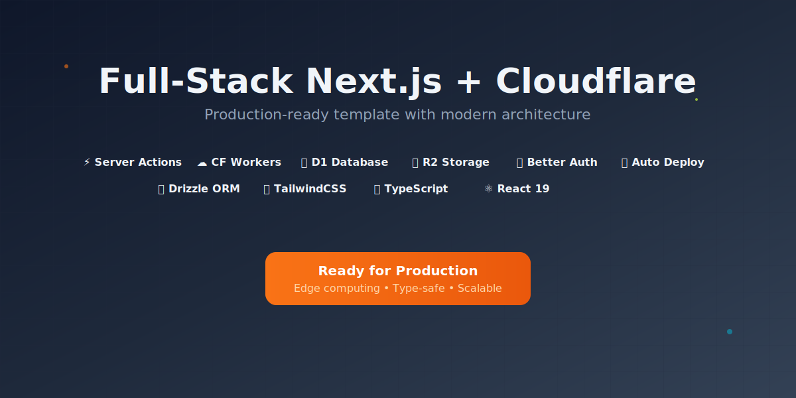

# 🚀 Full-Stack Next.js + Cloudflare Template

A production-ready template for building full-stack applications with Next.js 15 and Cloudflare's powerful edge infrastructure. Perfect for MVPs with generous free tiers and seamless scaling to enterprise-level applications.

**Inspired by the [Cloudflare SaaS Stack](https://github.com/supermemoryai/cloudflare-saas-stack)** - the same stack powering [Supermemory.ai](https://git.new/memory), which serves 20k+ users on just $5/month. This template modernizes that approach with Cloudflare Workers (vs Pages), includes comprehensive D1 and R2 examples, and provides a complete development workflow.

## 🌟 Why Cloudflare + Next.js?

**Cloudflare's Edge Network** provides unparalleled performance and reliability:
- ⚡ **Ultra-low latency** - Deploy to 300+ locations worldwide
- 💰 **Generous free tiers** - Perfect for MVPs and side projects
- 📈 **Effortless scaling** - From zero to millions of users automatically
- 🔒 **Built-in security** - DDoS protection, WAF, and more
- 🌍 **Global by default** - Your app runs close to every user

Combined with **Next.js 15**, you get modern React features, Server Components, and Server Actions for optimal performance and developer experience.

## 🛠️ Tech Stack

### 🎯 **Frontend**
- ⚛️ **Next.js 15** - App Router with React Server Components (RSC)
- 🎨 **TailwindCSS 4** - Utility-first CSS framework
- 📘 **TypeScript** - Full type safety throughout
- 🧩 **Radix UI** - Unstyled, accessible components
- 📋 **React Hook Form + Zod** - Type-safe form handling

### ☁️ **Backend & Infrastructure**
- 🌐 **Cloudflare Workers** - Serverless edge compute platform
- 🗃️ **Cloudflare D1** - Distributed SQLite database at the edge
- 📦 **Cloudflare R2** - S3-compatible object storage
- 🔑 **Better Auth** - Modern authentication with Google OAuth
- 🛠️ **Drizzle ORM** - TypeScript-first database toolkit

### 🚀 **DevOps & Deployment**
- ⚙️ **GitHub Actions** - Automated CI/CD pipeline
- 🔧 **Wrangler** - Cloudflare's CLI tool
- 👁️ **Preview Deployments** - Test changes before production
- 🔄 **Database Migrations** - Version-controlled schema changes
- 💾 **Automated Backups** - Production database safety

### 📊 **Data Flow Architecture**
- **Fetching**: Server Actions + React Server Components for optimal performance
- **Mutations**: Server Actions with automatic revalidation
- **Type Safety**: End-to-end TypeScript from database to UI
- **Caching**: Built-in Next.js caching with Cloudflare edge caching

## 🚀 Getting Started

### 1. Prerequisites

- **Cloudflare Account** - [Sign up for free](https://dash.cloudflare.com/sign-up)
- **Node.js 20+** and **pnpm** installed
- **Google OAuth App** - For authentication setup

### 2. Create Cloudflare API Token

Create an API token for Wrangler authentication:

1. In the Cloudflare dashboard, go to the **Account API tokens** page
2. Select **Create Token** > find **Edit Cloudflare Workers** > select **Use Template**
3. Customize your token name (e.g., "Next.js Cloudflare Template")
4. Scope your token to your account and zones (if using custom domains)
5. **Add additional permissions** for D1 database access:
   - Account - D1:Edit
   - Account - D1:Read

**Final Token Permissions:**
- All permissions from "Edit Cloudflare Workers" template
- Account - D1:Edit (for database operations)
- Account - D1:Read (for database queries)

### 3. Clone and Setup

```bash
# Clone the repository
git clone https://github.com/ifindev/fullstack-next-cloudflare.git
cd fullstack-next-cloudflare

# Install dependencies
pnpm install
```

### 4. Environment Configuration

Create your environment file:

```bash
# Copy example environment file
cp .dev.vars.example .dev.vars
```

Edit `.dev.vars` with your credentials:

```bash
# Cloudflare Configuration
CLOUDFLARE_ACCOUNT_ID=your-account-id
CLOUDFLARE_D1_TOKEN=your-api-token

# Authentication Secrets
BETTER_AUTH_SECRET=your-random-secret-here
GOOGLE_CLIENT_ID=your-google-client-id
GOOGLE_CLIENT_SECRET=your-google-client-secret

# Storage
CLOUDFLARE_R2_URL=your-r2-bucket-url
```

### 5. Authentication Setup

**Better Auth Secret:**
```bash
# Generate a random secret
openssl rand -base64 32
# Add to BETTER_AUTH_SECRET in .dev.vars
```

**Google OAuth Setup:**
Follow the [Better Auth Google documentation](https://www.better-auth.com/docs/authentication/google) to:
1. Create a Google OAuth 2.0 application
2. Get your Client ID and Client Secret
3. Add authorized redirect URIs

### 6. Storage Setup

**For Local Development:**
```bash
# Create R2 bucket for local development
wrangler r2 bucket create next-cf-app-bucket-dev

# Get the bucket URL and add to .dev.vars as CLOUDFLARE_R2_URL
```

**For Production:**
The GitHub Actions workflow will create the production bucket automatically. After deployment, update your production secrets with the R2 URL.

## 🛠️ Manual Setup (Detailed)

If you prefer to set everything up manually or want to understand each step in detail, follow this comprehensive guide.

### Step 1: Create Cloudflare Resources

**Create D1 Database:**
```bash
# Create a new SQLite database at the edge
wrangler d1 create your-app-name

# Output will show:
# database_name = "your-app-name"
# database_id = "xxxxxxxx-xxxx-xxxx-xxxx-xxxxxxxxxxxx"
```

**Create R2 Bucket:**
```bash
# Create object storage bucket
wrangler r2 bucket create your-app-bucket

# List buckets to confirm
wrangler r2 bucket list
```

### Step 2: Configure Wrangler

Update `wrangler.jsonc` with your resource IDs:

```jsonc
{
    "name": "your-app-name",
    "d1_databases": [
        {
            "binding": "DB",
            "database_name": "your-app-name",
            "database_id": "your-database-id-from-step-1",
            "migrations_dir": "./src/drizzle"
        }
    ],
    "r2_buckets": [
        {
            "bucket_name": "your-app-bucket",
            "binding": "FILES"
        }
    ]
}
```

### Step 3: Set Up Authentication

**Generate Better Auth Secret:**
```bash
# On macOS/Linux
openssl rand -base64 32

# On Windows (PowerShell)
[System.Convert]::ToBase64String([System.Security.Cryptography.RandomNumberGenerator]::GetBytes(32))

# Or use online generator: https://generate-secret.vercel.app/32
```

**Configure Google OAuth:**
1. Go to [Google Cloud Console](https://console.cloud.google.com/)
2. Create a new project or select existing one
3. Enable Google+ API
4. Create OAuth 2.0 credentials
5. Add authorized redirect URIs:
   - `http://localhost:3000/api/auth/callback/google` (development)
   - `https://your-app.your-subdomain.workers.dev/api/auth/callback/google` (production)

### Step 4: Environment Configuration

**Create Local Environment File:**
```bash
# .dev.vars for local development
CLOUDFLARE_ACCOUNT_ID=your-account-id
CLOUDFLARE_D1_TOKEN=your-api-token
BETTER_AUTH_SECRET=your-generated-secret
GOOGLE_CLIENT_ID=your-google-client-id.apps.googleusercontent.com
GOOGLE_CLIENT_SECRET=your-google-client-secret
CLOUDFLARE_R2_URL=https://your-bucket.your-account-id.r2.cloudflarestorage.com
```

**Set Production Secrets:**
```bash
# Add each secret to Cloudflare Workers
echo "your-secret-here" | wrangler secret put BETTER_AUTH_SECRET
echo "your-client-id" | wrangler secret put GOOGLE_CLIENT_ID
echo "your-client-secret" | wrangler secret put GOOGLE_CLIENT_SECRET
echo "your-r2-url" | wrangler secret put CLOUDFLARE_R2_URL
```

### Step 5: Database Setup

**Generate TypeScript Types:**
```bash
# Generate Cloudflare bindings for TypeScript
pnpm run cf-typegen
```

**Initialize Database:**
```bash
# Generate initial migration from schema
pnpm run db:generate

# Apply migrations to local database
pnpm run db:migrate:local

# Verify database structure
pnpm run db:inspect:local
```

**Optional: Seed Sample Data**
```bash
# Create and run a seed script
wrangler d1 execute your-app-name --local --command="
INSERT INTO todos (id, title, description, completed, created_at, updated_at) VALUES
('1', 'Welcome to your app', 'This is a sample todo item', false, datetime('now'), datetime('now')),
('2', 'Set up authentication', 'Configure Google OAuth', true, datetime('now'), datetime('now'));
"
```

### Step 6: Test Your Setup

**Start Development Servers:**
```bash
# Terminal 1: Start Wrangler (provides D1 access)
pnpm run wrangler:dev

# Terminal 2: Start Next.js (provides HMR)
pnpm run dev

# Alternative: Single command (no HMR)
pnpm run dev:cf
```

**Verify Everything Works:**
1. Open `http://localhost:3000`
2. Test authentication flow
3. Create a todo item
4. Check database: `pnpm run db:studio:local`

### Step 7: Set Up GitHub Actions (Optional)

**Add Repository Secrets:**
Go to your GitHub repository → Settings → Secrets and add:

- `CLOUDFLARE_API_TOKEN` - Your API token from Step 2
- `CLOUDFLARE_ACCOUNT_ID` - Your account ID
- `BETTER_AUTH_SECRET` - Your auth secret
- `GOOGLE_CLIENT_ID` - Your Google client ID
- `GOOGLE_CLIENT_SECRET` - Your Google client secret
- `CLOUDFLARE_R2_URL` - Your R2 bucket URL

**Deploy Production Database:**
```bash
# Apply migrations to production
pnpm run db:migrate:prod

# Verify production database
pnpm run db:inspect:prod
```

## 🔧 Advanced Manual Configuration

### Custom Domain Setup

**Add Custom Domain:**
1. Go to Cloudflare dashboard → Workers & Pages
2. Select your worker → Settings → Triggers
3. Click "Add Custom Domain"
4. Enter your domain (must be in your Cloudflare account)

**Update OAuth Redirect URLs:**
Add your custom domain to Google OAuth settings:
- `https://yourdomain.com/api/auth/callback/google`

### Database Optimization

**Add Indexes for Performance:**
```sql
-- Create indexes for better query performance
CREATE INDEX IF NOT EXISTS idx_todos_user_id ON todos(user_id);
CREATE INDEX IF NOT EXISTS idx_todos_created_at ON todos(created_at);
CREATE INDEX IF NOT EXISTS idx_todos_completed ON todos(completed);
```

**Monitor Database Performance:**
```bash
# View database insights
wrangler d1 insights your-app-name --since 1h

# Export data for analysis
wrangler d1 export your-app-name --output backup.sql
```

### R2 Storage Configuration

**Configure CORS for Direct Uploads:**
```bash
# Create CORS policy file
echo '[
  {
    "AllowedOrigins": ["https://yourdomain.com", "http://localhost:3000"],
    "AllowedMethods": ["GET", "PUT", "POST", "DELETE"],
    "AllowedHeaders": ["*"],
    "ExposeHeaders": [],
    "MaxAgeSeconds": 3000
  }
]' > cors.json

# Apply CORS policy
wrangler r2 bucket cors put your-app-bucket --file cors.json
```

### Performance Monitoring

**Enable Advanced Analytics:**
```jsonc
// Add to wrangler.jsonc
{
  "observability": {
    "enabled": true,
    "head_sampling_rate": 1
  },
  "analytics_engine_datasets": [
    {
      "binding": "ANALYTICS",
      "dataset": "your-analytics-dataset"
    }
  ]
}
```

## 🏃‍♂️ Development Workflow

### Initial Setup
```bash
# 1. Generate Cloudflare types (run after any wrangler.jsonc changes)
pnpm run cf-typegen

# 2. Apply database migrations
pnpm run db:migrate:local

# 3. Build the application for Cloudflare
pnpm run build:cf
```

### Daily Development
```bash
# Terminal 1: Start Wrangler for D1 database access
pnpm run wrangler:dev

# Terminal 2: Start Next.js development server with HMR
pnpm run dev
```

**Development URLs:**
- 🌐 **Next.js with HMR**: `http://localhost:3000` (recommended)
- ⚙️ **Wrangler Dev Server**: `http://localhost:8787`

### Alternative Development Options
```bash
# Single command - Cloudflare runtime (no HMR)
pnpm run dev:cf

# Test with remote Cloudflare resources
pnpm run dev:remote
```

## 📜 Available Scripts

### **Core Development**
| Script | Description |
|--------|-------------|
| `pnpm dev` | Start Next.js with HMR |
| `pnpm run build:cf` | Build for Cloudflare Workers |
| `pnpm run wrangler:dev` | Start Wrangler for local D1 access |
| `pnpm run dev:cf` | Combined build + Cloudflare dev server |

### **Database Operations**
| Script | Description |
|--------|-------------|
| `pnpm run db:generate` | Generate new migration |
| `pnpm run db:generate:named "migration_name"` | Generate named migration |
| `pnpm run db:migrate:local` | Apply migrations to local D1 |
| `pnpm run db:migrate:preview` | Apply migrations to preview |
| `pnpm run db:migrate:prod` | Apply migrations to production |
| `pnpm run db:studio:local` | Open Drizzle Studio for local DB |
| `pnpm run db:inspect:local` | List local database tables |
| `pnpm run db:reset:local` | Reset local database |

### **Deployment & Production**
| Script | Description |
|--------|-------------|
| `pnpm run deploy` | Deploy to production |
| `pnpm run deploy:preview` | Deploy to preview environment |
| `pnpm run cf-typegen` | Generate Cloudflare TypeScript types |
| `pnpm run cf:secret` | Add secrets to Cloudflare Workers |

### **Development Order**

**First-time setup:**
1. `pnpm run cf-typegen` - Generate types
2. `pnpm run db:migrate:local` - Setup database
3. `pnpm run build:cf` - Build application

**Daily development:**
1. `pnpm run wrangler:dev` - Start D1 access (Terminal 1)
2. `pnpm run dev` - Start Next.js with HMR (Terminal 2)

**After schema changes:**
1. `pnpm run db:generate` - Generate migration
2. `pnpm run db:migrate:local` - Apply to local DB

**After wrangler.jsonc changes:**
1. `pnpm run cf-typegen` - Regenerate types

## 🏗️ Project Structure

This template uses a **feature-based/module-sliced architecture** for better maintainability and scalability:

```
src/
├── app/                    # Next.js App Router
│   ├── (auth)/            # Auth-related pages
│   ├── api/               # API routes (for external access)
│   ├── dashboard/         # Dashboard pages
│   └── globals.css        # Global styles
├── components/            # Shared UI components
├── constants/             # App constants
├── db/                    # Database configuration
│   ├── index.ts          # DB connection
│   └── schema.ts         # Database schemas
├── lib/                   # Shared utilities
├── modules/               # Feature modules
│   ├── auth/             # Authentication module
│   │   ├── actions/      # Auth server actions
│   │   ├── components/   # Auth components
│   │   ├── hooks/        # Auth hooks
│   │   ├── models/       # Auth models
│   │   ├── schemas/      # Auth schemas
│   │   └── utils/        # Auth utilities
│   ├── dashboard/        # Dashboard module
│   └── todos/            # Todo module
│       ├── actions/      # Todo server actions
│       ├── components/   # Todo components
│       ├── models/       # Todo models
│       └── schemas/      # Todo schemas
└── drizzle/              # Database migrations
```

**Key Architecture Benefits:**
- 🎯 **Feature Isolation** - Each module contains its own actions, components, and logic
- 🔄 **Server Actions** - Modern data mutations with automatic revalidation
- 📊 **React Server Components** - Optimal performance with server-side rendering
- 🛡️ **Type Safety** - End-to-end TypeScript from database to UI
- 🧪 **Testable** - Clear separation of concerns makes testing easier

## 🔧 Advanced Configuration

### Database Schema Changes
```bash
# 1. Modify schema files in src/db/schemas/
# 2. Generate migration
pnpm run db:generate:named "add_user_table"
# 3. Apply to local database
pnpm run db:migrate:local
# 4. Test your changes
# 5. Commit and deploy (migrations run automatically)
```

### Adding New Cloudflare Resources
```bash
# 1. Update wrangler.jsonc with new resources
# 2. Regenerate types
pnpm run cf-typegen
# 3. Update your code to use new bindings
```

### Production Secrets Management
```bash
# Add secrets to production environment
pnpm run cf:secret BETTER_AUTH_SECRET
pnpm run cf:secret GOOGLE_CLIENT_ID
pnpm run cf:secret GOOGLE_CLIENT_SECRET
```

## 📊 Performance & Monitoring

**Built-in Observability:**
- ✅ Cloudflare Analytics (enabled by default)
- ✅ Real User Monitoring (RUM)
- ✅ Error tracking and logging
- ✅ Performance metrics

**Database Monitoring:**
```bash
# Monitor database performance
wrangler d1 insights next-cf-app

# View database metrics in Cloudflare Dashboard
# Navigate to Workers & Pages → D1 → next-cf-app → Metrics
```

## 🚀 Deployment

### Automatic Deployment (Recommended)

Push to `main` branch triggers automatic deployment via GitHub Actions:

```bash
git add .
git commit -m "feat: add new feature"
git push origin main
```

**Deployment Pipeline:**
1. ✅ Install dependencies
2. ✅ Build application
3. ✅ Run database migrations
4. ✅ Deploy to Cloudflare Workers
5. ✅ Health check verification

### Manual Deployment

```bash
# Deploy to production
pnpm run deploy

# Deploy to preview environment
pnpm run deploy:preview
```


## 🤝 Contributing

Contributions are welcome! Please feel free to submit issues and pull requests.

## 📝 License

This project is licensed under the MIT License - see the [LICENSE](LICENSE) file for details.

---

© 2025 Muhammad Arifin. All rights reserved.
